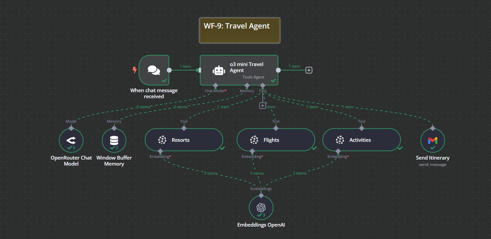

# WF-9: Travel Agent – n8n Workflow

## 📌 Overview
This **n8n workflow**, `WF-9: Travel Agent`, automates personalized trip planning by retrieving details about resorts, flights, and activities. It generates a structured itinerary and sends it via email in a human-readable HTML format.

## 🔧 Workflow Components
### 🏗️ Core Modules
1. **💬 Chat Trigger** – Activates the workflow upon receiving a travel-related query.
2. **🤖 AI Travel Agent** – Processes user requests and retrieves trip details.
3. **📍 Resorts Tool** – Fetches resort options based on destination and traveler preferences.
4. **✈️ Flights Tool** – Retrieves flight options, including schedules and pricing.
5. **🎭 Activities Tool** – Suggests activities based on the travel destination and interests.
6. **🗂️ Pinecone Vector Store** – Stores and retrieves travel data efficiently.
7. **🧠 Memory Buffer** – Maintains conversation context for more personalized responses.
8. **📄 OpenAI Embeddings** – Enhances search accuracy for relevant trip recommendations.
9. **📧 Send Itinerary** – Sends the final itinerary via email in a structured HTML format.

## ⚙️ How It Works
1. 💬 **Chat Trigger** initiates when a user sends a travel-related request.
2. 🤖 The **AI Travel Agent** processes the request and calls the necessary tools.
3. 📍 **Resorts Tool** retrieves accommodation options at the travel destination.
4. ✈️ **Flights Tool** fetches flight schedules and prices.
5. 🎭 **Activities Tool** suggests relevant attractions and experiences.
6. 🗂️ **Pinecone Vector Store** ensures efficient document retrieval for itinerary details.
7. 📄 **OpenAI Embeddings** generate structured data for trip recommendations.
8. 📧 The **Send Itinerary** tool emails a finalized, human-readable itinerary in HTML format.

## 📷 Workflow Screenshot

## 🚀 Setup Instructions
- 📥 **Import the workflow** into `n8n`.
- 🔑 **Ensure API credentials** for Pinecone, OpenAI, and Gmail are configured.
- ✅ **Activate the workflow** to start generating personalized trip itineraries.

## 📝 Notes
- ⚠️ The workflow is **inactive by default**.
- 🛠️ Customize the **itinerary formatting, flight selection criteria, and resort preferences** as needed.
- 📊 Optimized for **detailed, user-friendly travel planning**.
